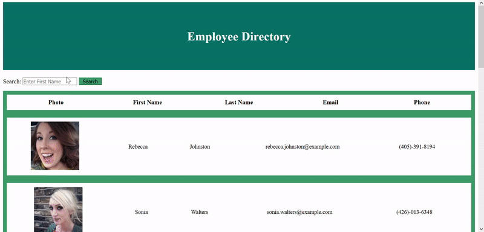

# Employee Directory

Allows employees or managers to view non-sensitive data about other employees and allows users to find employees by name.

## Use Story

As a user, I want to be able to view a list of employees and their non-sensitive information as well as search by name so that I can have fast access to that information.

## Usage

- Fork and clone the repository onto your local machine. Then run `npm install` to install the dependencies.
- The current data is randomly generated with the [randomuser.me](https://randomuser.me/) API, so make sure that it gets replaced with your own employee database or array.
- Deployed website can be found [here.](https://gwensanabria.github.io/Employee_Directory/)

- 

## License

